# 1. Teoría:

• Describe los principios fundamentales de los contenedores Docker y su arquitectura interna.
Explica cómo Docker maneja la seguridad y el aislamiento de contenedores.

- Portabilidad: al ser independientes de la estructura que porta al docker, se puede ejecutar en diversos ambientes y se puede ejecutar sin necesidad de un sistema operativo
- Aislamiento: Los procesos de un contenedor a otro son independientes, es como si fuera otro entorno
- Escalabilidad: Se puede escalar debido a que podemos ejecutar multiples contenedores de la misma aplicación en simultaneo
- Inmutabilidad: Lo inmutable son los contenedores y las imagenes dentro, se tienen que crear nuevas para poder crear una actualización

Arquitectura: 
- Docker Engine ( demonio, cliente y registros): El demonio se encarga de la supervisión y ejecución de los contenedores, el cliente de como interactuar con el contenedor, finalmente los registros es el lugar donde se almacenan las imagenes.

- imagenes y contenedores. 

Seguridad:
Docker cuenta con redes virtuales los cuales permiten a los contenedores comunicarse entre sí mientras están aislados(network isolation)

• Compara y contrasta Docker con soluciones de virtualización tradicionales, como VMware y
VirtualBox. Discute las ventajas y desventajas de cada enfoque
Ventaja: Docker es más ligero y con mayor rendimiento debido a su poco consumo
Desventaja: Las VMs tienen mayor seguridad al estar aisladas en otro sistema operativo

# 1. Práctica

• Escribe un Dockerfile para la aplicación Tower Defense que incluya la instalación de todas las
dependencias necesarias. Asegúrate de optimizar el Dockerfile para reducir el tamaño de la
imagen final.
* Se indica la versión jdk de nuestro sistema
* Dentro de nuestro paquete org/example corre todos los archivos java
* Para poder crear la imagen con los archivos dentro, se colocan los siguientes parámetros
* Además para poder ejecutar el docker exec se usa tail -f /dev/null, exec sirve para depurar y ejecutar tareas
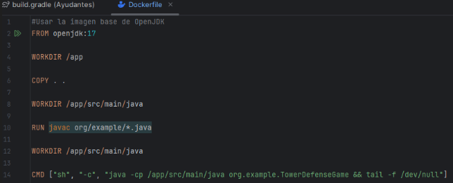

• Construye y ejecuta el contenedor Docker utilizando el Dockerfile creado. Utiliza docker exec
para acceder al contenedor y verificar que la aplicación funcione correctamente. 

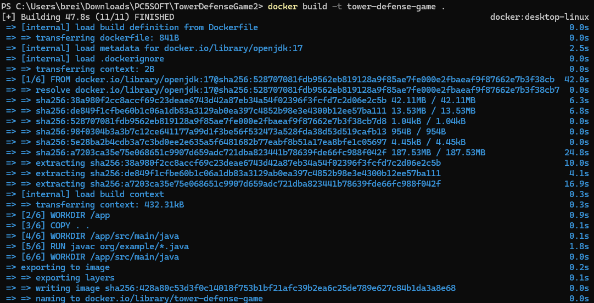

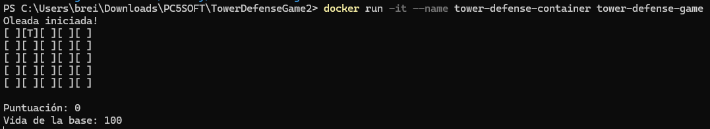

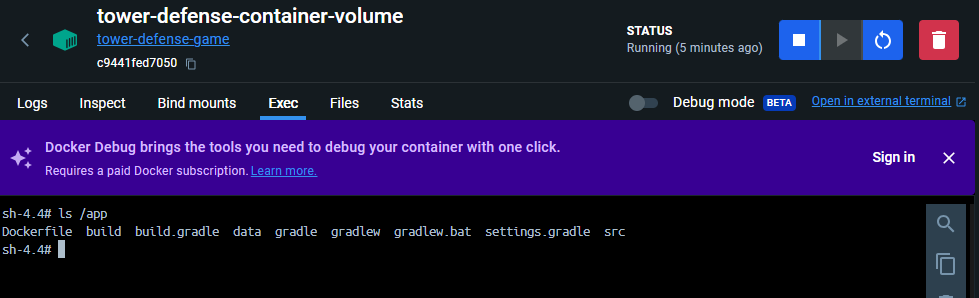

• Configura una red personalizada para la aplicación Tower Defense. Implementa múltiples
contenedores que interactúen entre sí a través de esta red personalizada.

Primero se crea la red a la que unir nuestros contenedores 
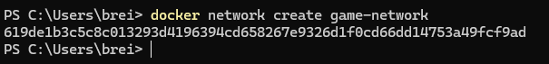

Luego conectamos un contenedor

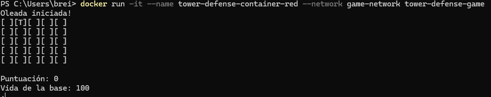

Luego otro a nuestra red

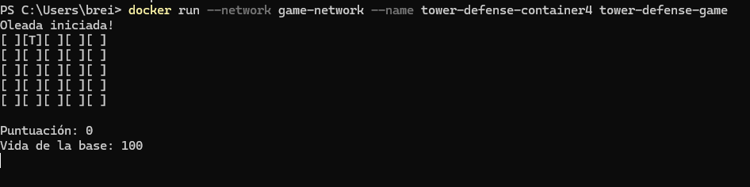

Podemos verificar todos los containers creados desde el docker desktop o desde linea de comandos(docker ps -a)
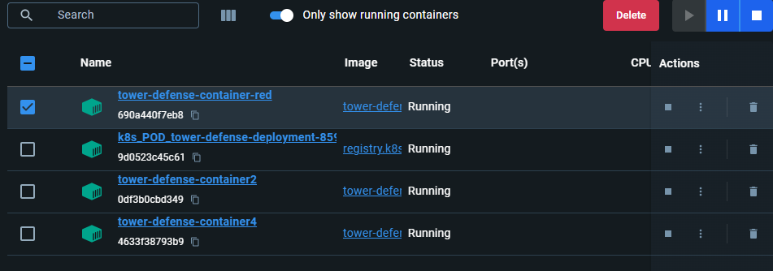
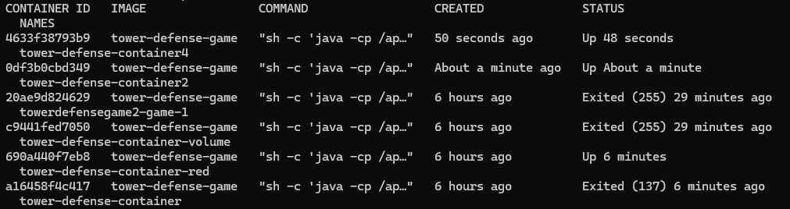

# 2. Teorico

• Explica en detalle cómo Docker maneja las redes y los volúmenes. Discute los diferentes
tipos de redes (bridge, host, overlay) y cuándo es apropiado usar cada una.

Bridge: Es el tipo de red por defecto,los contenedores se pueden conectar entre sí, sirve para comunicaciones entre sí pero no con el host

Host: Este tipo de red, no aisla a los contenedores de la red del host, sirve cuando se busca más exigencia para acceder a servicios de red

Overlay: Permite la comunicación entre contenedores de diferentes host que pueden estar distribuidas en diversos nodos

• Describe los mecanismos de persistencia de datos en Docker, incluyendo volúmenes y bind
mounts. Explica las diferencias entre ellos y las mejores prácticas para su uso

Volumenes:
-Volumenes: Datos persistentes fuera del contenedor
Ventaja: Buen rendimiento y seguridad

- Bind mounts: Se guarda registro de los directorios del host directamente en el contenedor
Ventaja: Flexibilidad en el acceso de los archivos del host

Usar volumenes en casos de datos persistentes y críticos. Bind mounts se recomienda usar en desarrollo para editar facilmente los archivos

# 2. Práctico

• Implementa un volumen Docker para almacenar los datos del juego de forma persistente.
Asegúrate de que el volumen se monte correctamente y que los datos persistan después de
reiniciar el contenedor.

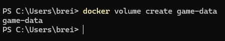

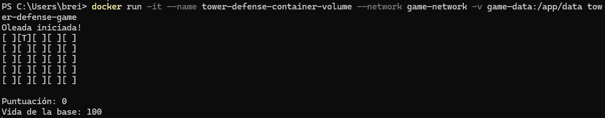

• Utiliza docker-compose para definir los servicios de la aplicación Tower Defense, incluyendo
redes y volúmenes. Escribe un archivo docker-compose.yml que configure estos servicios y
despliega la aplicación utilizando Docker Compose.

Hubo una pequeña modificación en la primera linea de código para las nuevas versiones de docker

Services: Incluye la imagen que utilizará, la red y el volumen

Networks: la configuración que se está aplicando al contenedor multicontainer

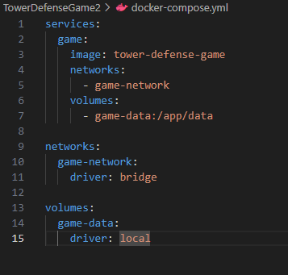

Y ejecutamos docker-compose para lanzar nuestros servicios
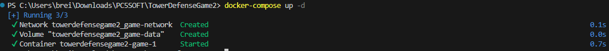

# 3. Teórico

• Describe la arquitectura de Kubernetes y sus componentes principales, incluyendo el API
server, etcd, scheduler, y kubelet. Explica cómo estos componentes interactúan para
gestionar un clúster de Kubernetes.

1. API Server:

Función: Punto de entrada para todas las operaciones del clúster.

Interacción: Maneja solicitudes RESTful y comunica cambios a otros componentes.

2. etcd:

Función: Almacén de datos clave-valor distribuido que guarda la configuración y el estado del clúster.

Interacción: API Server consulta y guarda datos en etcd.
3. Scheduler:

Función: Asigna pods a nodos según la disponibilidad de recursos y las políticas definidas.

Interacción: Recibe solicitudes del API Server para programar nuevos pods.

4. Kubelet:

Función: Agente que corre en cada nodo del clúster, asegurando que los contenedores estén ejecutándose según las definiciones de los pods.

Interacción: Se comunica con el API Server para recibir instrucciones y reportar el estado del nodo.

• Discute las estrategias de escalabilidad y alta disponibilidad en Kubernetes. Explica cómo
Kubernetes maneja la recuperación de fallos y la gestión de réplicas.

Escalabilidad: Existe el autoescalado de pods y escalado de nodos

Alta disponibilidad: Replicasets( multiples instancias de pods), distribución de pods(distribución para evitar puntos de falla)

Recuperación de fallos: Detección y reprogramación, autocuración

# 3. Práctico
• Escribe un archivo deployment.yaml para la aplicación Tower Defense. Asegúrate de definir
los recursos necesarios (CPU, memoria) y las políticas de escalabilidad.

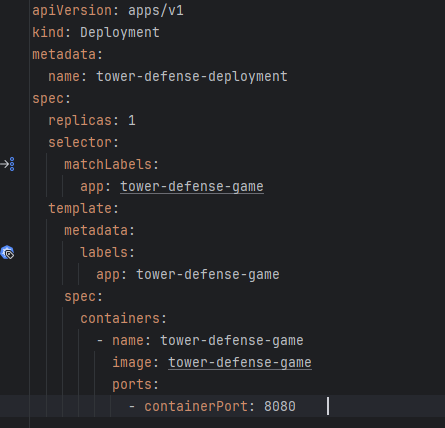

• Implementa un Service en Kubernetes para exponer la aplicación Tower Defense a través de
una IP pública. Utiliza un LoadBalancer para distribuir el tráfico entre múltiples réplicas de la
aplicación.
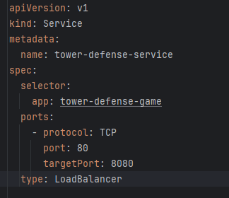

• Despliega la aplicación Tower Defense en un clúster de Kubernetes. Utiliza kubectl para
gestionar el despliegue y verificar que la aplicación funcione correctamente en el clúster
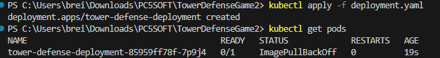
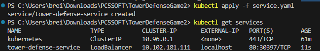
Usamos get pods para ver todos los pods creados y get deployments para ver todos deployments en el clúster

# 4. Teórico 

•Explica los conceptos de mocks, stubs y fakes. Discute cuándo y cómo se deben utilizar estos
patrones en las pruebas unitarias.

- Mocks
Uso: Validar que ciertos métodos se llamaron con los parámetros correctos. En nuestro caso para las pruebas de Tower Defense podemos simular las clases map, player, wave y sus metodos.

Cuándo Usar: Cuando se necesita comprobar la interacción con dependencias.

- Stubs

Uso: Proveer respuestas controladas a llamadas específicas.

Cuándo Usar: Cuando se necesita simular el comportamiento de una dependencia sin lógica compleja. En el juego podemos simular el estado del juego por ejemplo si acabó la ronda,si perdimos todos los puntos de vida o si ponemos alguna torre
- Fakes 

Uso: Proveer funcionalidad básica para pruebas.

Cuándo Usar: Para pruebas más completas donde se requiere una lógica más realista sin dependencias pesadas. En el caso del proyecto podemos implementar un registro de jugadores o sistema de puntos

• Describe el proceso de creación de pruebas unitarias con Mockito. Explica cómo se pueden
simular dependencias y verificar comportamientos en las pruebas.

El proceso sigue los siguientes pasos

Añadir Mockito como dependencia en el proyecto.

Utilizar @Mock o Mockito.mock(Class.class) para crear objetos simulados.

Usar when(...).thenReturn(...) para definir comportamientos de métodos.

Utilizar verify(...) para asegurarse de que los métodos fueron llamados con los parámetros correctos.

# 4. Práctica 

• Escribe pruebas unitarias para la clase TowerDefenseGame utilizando Mockito para simular
las dependencias de Map, Player y Wave.
Se usan mocks para inducir dependencias 
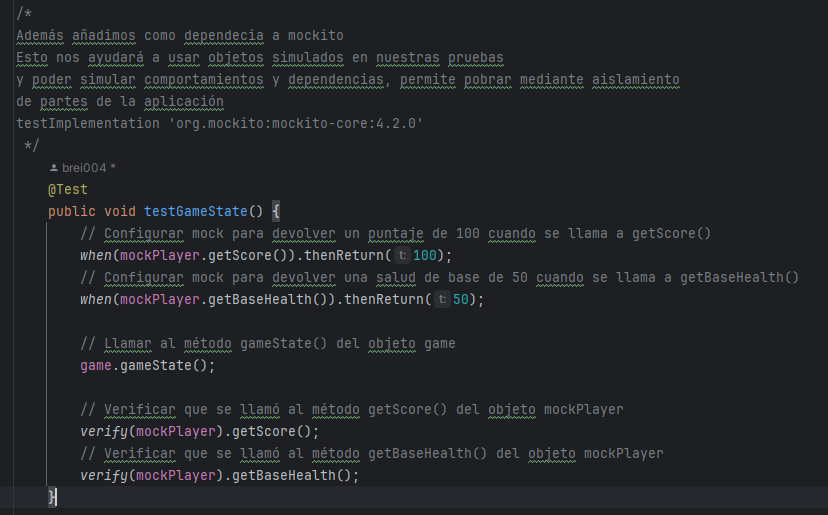
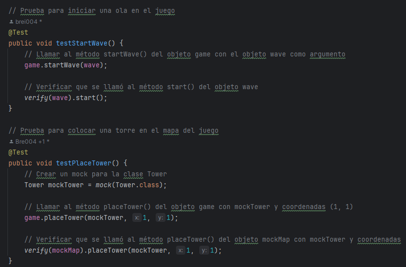

• Implementa pruebas de integración que verifiquen la interacción entre las clases principales
(TowerDefenseGame, Map, Player, Wave). Utiliza Mockito para controlar y verificar el
comportamiento de las dependencias en estas pruebas.
Las pruebas de integración a diferencia de las unitarias muestran como se comporta en conjunto diferentes objetos que interactúan entre sí 
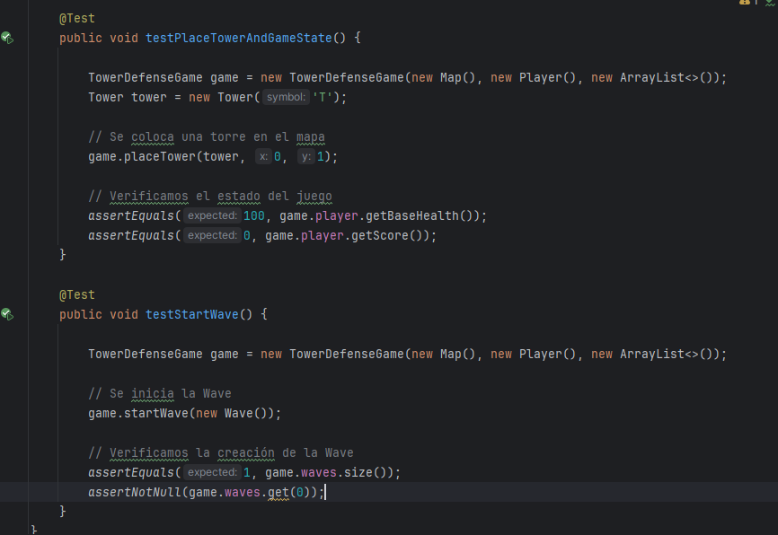
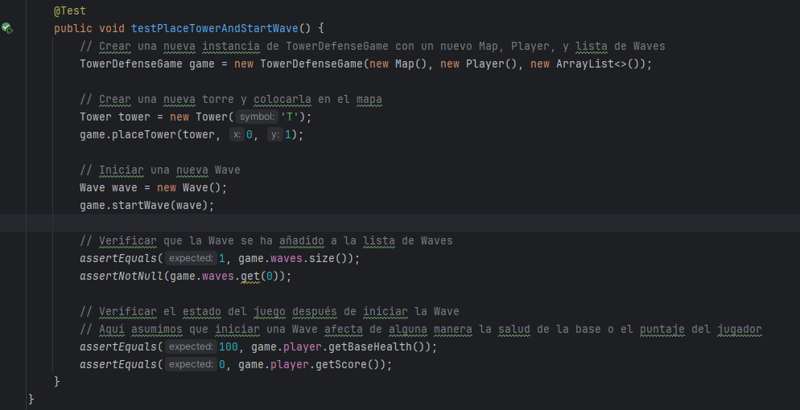

# 5. Teoría

• Define qué son las pruebas de mutación y cómo contribuyen a la mejora de la calidad del
software. Explica los tipos de operadores de mutación y su propósito.
- Las pruebas de mutación nos permite evaluar la calidad de nuestras pruebas unitarias mediante cambios o mutaciones en nuestro código y verificar si las pruebas muestran esos cambios en el resultado.
- Operadores:Lógicos, Aritmeticos, Relación,Constante, de flujo 

• Discute las métricas utilizadas para evaluar la efectividad de las pruebas de mutación, como
la tasa de mutación (mutation score) y la cobertura de mutación

- Tasa de mutación: 
Mide la efectividad de las pruebas al matar a los mutantes y es el cálculo de (mutantes muertos/mutantes totales) *100

- Cobertura de mutación:
Verifica la cantidad de lineas mutantes se ejecutaron del código

# 5. Práctica

• Configura una herramienta de pruebas de mutación, como PIT, en el proyecto Tower
Defense. 
Configuramos los plugins y pitest para realizar las pruebas mutantes
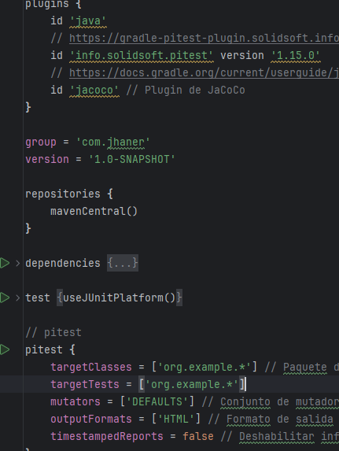
• Implementa pruebas de mutación para la clase Map y analiza los resultados. Asegúrate de
identificar y corregir las pruebas unitarias que no detecten mutaciones.

Este resultado muestra que las mutaciones aplicadas a nuestro codigo no son detectadas por nuestro código, nuestra cobertura es muy pobre aunque la cobertura de lineas es amplia. Implementaremos test más especificos para aumentar la cobertura de mutación 

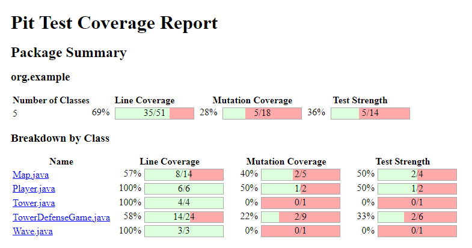

En la clase Tower nunca se verifica si al cambiar el caracter lanze la excepción y porque nunca se detecta el retorno de un simbolo como retorno, por eso se tiene que añadir un getSymbol en las pruebas

En la clase wave no existen pruebas para verificar la salida por consola y tampoco el correcto retorno del booleano para la inicialización de la wave

Implementamos los tests para aumentar la cobertura
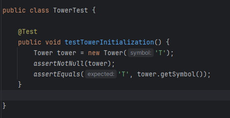
Se modifica la clase Wave 
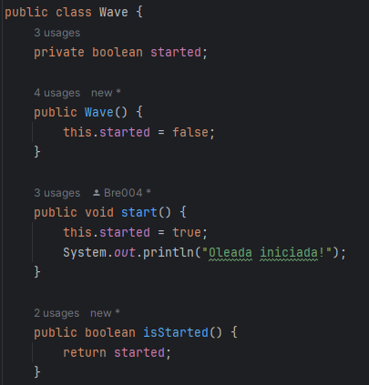

Se agregan los test unitarios 
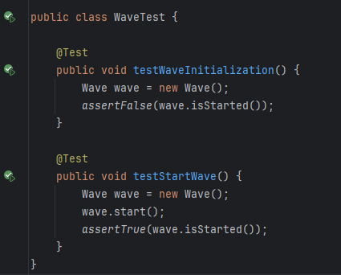

Aumenta la cobertura de mutación gracias a los nuevos tests, ahora se cubren partes más especificas del código

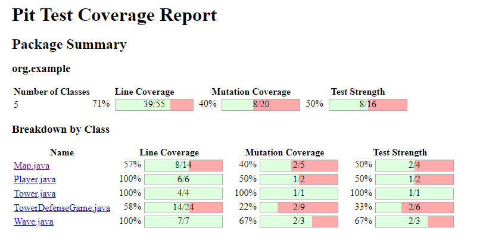

• Realiza un informe detallado sobre la calidad de las pruebas del proyecto Tower Defense,
basado en los resultados de las pruebas de mutación. Incluye recomendaciones para
mejorar la cobertura y efectividad de las pruebas
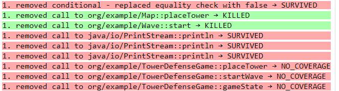

La cobertura no se da correctamente al no ver los sout que se muestran por consola en su mayoría.

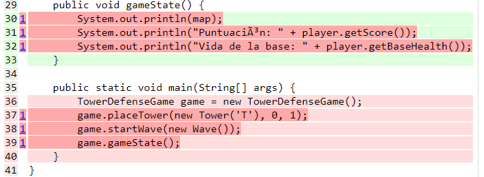

# 6. Teoría

• Explica el concepto de diseño por contrato y cómo se aplica en el desarrollo de software.
Discute las diferencias entre precondiciones, postcondiciones e invariantes.

El diseño por contrato es una metodología en el desarrollo de software que define las responsabilidades y resultados esperados en diferentes componentes del software.

- Precondiciones: Debe ser verdadera antes de que se ejecute un método
- Postcondiciones: Debe ser verdadera luego de que se ejecute un método
- Invariantes: Debe ser verdadero antes y luego de que la ejecución de cualquier método

• Describe cómo el diseño por contrato puede mejorar la robustez y mantenibilidad del
código.

Robustez: Es más robusto debido a las pre y post condiciones que nos permiten detectar errores de forma temprana y así reducir comportamientos no definidos

Mantenibilidad: Los pre, post e invariantes sirven como documentación que describe como se deberían de comportar los métodos y así poder refactorizar, además de poder mejorar nuestras pruebas

# 6. Práctica

• Aplica el diseño por contrato a la clase Tower. Define las precondiciones, postcondiciones e
invariantes de los métodos principales de la clase.

Aplicamos precondiciones para el caracter que se debe ingresar a la torre, un invariante que debe de ser siempre imprimible.

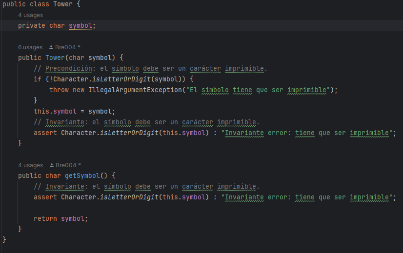
• Escribe pruebas unitarias que verifiquen el cumplimiento de los contratos definidos para la
clase Tower. Utiliza herramientas como Java Assertions para implementar estas
verificaciones.

Test1: Valida que el caracter sea un simbolo
Test2: Verifica que el caracter sea imprimible
Test3: Verifica que el caracter sea el simbolo de una torre
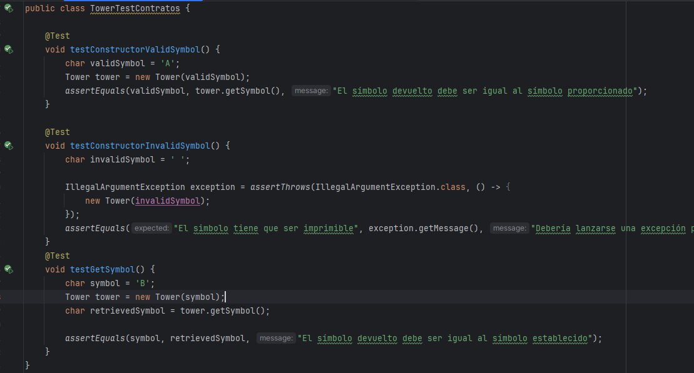
